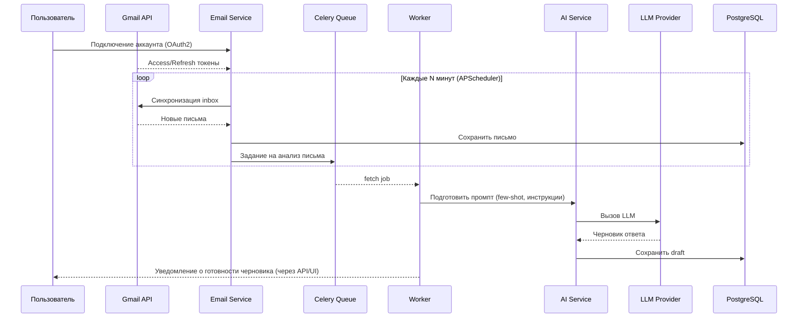
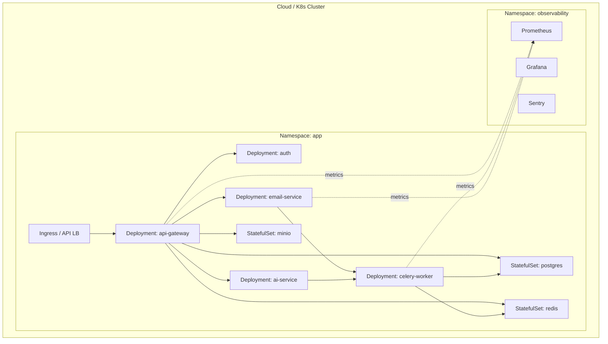

# AI Assistant for SMB

## 📌 Описание проекта
AI-ассистент для малого и среднего бизнеса (SMB), который автоматизирует рутинные задачи:
- Генерация документов (коммерческие предложения, договоры) по шаблонам с помощью LLM (ChatGPT / локальные модели).
- Интеграция с email (Gmail/Outlook): чтение входящих писем и генерация автоответов.
- Дашборд для аналитики (письма, документы, задачи).
- Поддержка ролей (админ, пользователь).
- Тарифные планы и биллинг через Stripe.

Проект задуман как **пет-проект уровня Middle+/Senior Python dev** и покрывает полный стек: FastAPI, PostgreSQL, Docker, CI/CD, Kubernetes, LLM-интеграции, мониторинг, безопасность, биллинг.

---

## 🚀 Roadmap

### Этап 1 — MVP
- FastAPI + PostgreSQL + Alembic.
- JWT аутентификация.
- CRUD для шаблонов и генерации документов.
- Подключение LLM (OpenAI API).
- Мини-фронт (Streamlit/Next.js).
- Деплой через Docker Compose.

### Этап 2 — Расширение
- Gmail/Outlook API интеграция.
- Автоответы на письма с помощью LLM.
- Планировщик задач (Celery/APScheduler).
- Dashboard с базовой аналитикой.
- RBAC (роли пользователей).

### Этап 3 — Продакшн
- Микросервисы: `auth`, `ai-service`, `email-service`, `dashboard`.
- Kubernetes + CI/CD.
- Мониторинг: Prometheus, Grafana, Sentry.
- OAuth2 через Google/Microsoft.
- Биллинг (Stripe/PayPal).
- Логирование и трассировка (OpenTelemetry).

### Этап 4 — Коммерциализация
- Кэширование LLM-запросов (Redis + pgvector).
- Подключение CRM (Hubspot/Pipedrive).
- Улучшение UX (mobile-first).
- Продуктовая аналитика (PostHog/Mixpanel).
- Маркетинг-лендинг и онбординг.

---

## 🛠️ Стек технологий

- **Backend**: Python 3.12+, FastAPI, Pydantic, SQLAlchemy 2.0
- **Database**: PostgreSQL, Alembic, Redis
- **Async & Queues**: Celery/RQ, APScheduler
- **Frontend**: Streamlit / Next.js (MVP)
- **AI**: OpenAI API, LangChain (опционально)
- **DevOps**: Docker, Docker Compose, Kubernetes, Helm, GitHub Actions
- **Monitoring**: Prometheus, Grafana, Sentry, OpenTelemetry
- **Auth & Security**: JWT, OAuth2, RBAC
- **Payments**: Stripe / PayPal

---

## ⚙️ Установка и запуск

### 1. Клонировать репозиторий
```bash
git clone https://github.com/your-username/ai-smb-assistant.git
cd ai-smb-assistant
```

### 2. Настроить окружение
Создать `.env` файл на основе `.env.example`:
```env
DATABASE_URL=postgresql+asyncpg://user:password@db:5432/app
REDIS_URL=redis://redis:6379/0
OPENAI_API_KEY=your_openai_api_key
STRIPE_API_KEY=your_stripe_api_key
JWT_SECRET=your_jwt_secret
```

### 3. Запуск в Docker
```bash
docker-compose up --build
```

### 4. Применить миграции
```bash
docker-compose run backend alembic upgrade head
```

### 5. Доступ к сервису
- Backend API: http://localhost:8000/docs
- Frontend (если Streamlit): http://localhost:8501

---

## 🧪 Тестирование
```bash
pytest --cov=app
```

---

## 📈 Мониторинг
- Prometheus: http://localhost:9090
- Grafana: http://localhost:3000
- Sentry: интеграция через DSN

---

## 📦 Деплой
- **MVP**: Docker Compose (Render/Heroku/DO)
- **Продакшн**: Kubernetes (k3s, Minikube, GKE/AKS/EKS)
- CI/CD: GitHub Actions (lint → test → build → deploy)

---

## 🤝 Контрибьютинг
PR и предложения приветствуются. Основной процесс разработки: feature-branch → pull request → code review → merge.

---

## 📜 Лицензия
MIT License. Используйте свободно, ссылаясь на авторов проекта.


---

## 🧩 Диаграммы (UML & Архитектура)

> Все диаграммы оформлены в **Mermaid** — GitHub их рендерит автоматически.  
> Если просматриваете локально, используйте плагины для VSCode/JetBrains или откройте файл в GitHub.

### 1) Обзор архитектуры (System Context / C4-уровень 1)

```mermaid
graph TD
    subgraph "Пользователи"
      U[Пользователь SMB]
    end

    subgraph "Внешние сервисы"
      G[Google OAuth]
      M[Microsoft OAuth]
      S[Stripe Billing]
      Gmail[Gmail API]
      Outlook[Outlook API]
      OAI[LLM Provider (OpenAI/Local)]
    end

    subgraph "AI Assistant for SMB (SaaS)"
      A[API Gateway / FastAPI]
      AU[Auth Service]
      AIS[AI Service]
      ES[Email Service]
      W[Worker / Celery]
      FE[Frontend (Streamlit/Next.js)]
      DB[(PostgreSQL)]
      R[(Redis)]
      OBJ[(Object Storage S3/MinIO)]
      MON[Monitoring: Prometheus/Grafana/Sentry]
    end

    U -->|JWT/OAuth| A
    A --> AU
    A --> FE
    A --> AIS
    A --> ES
    A --> DB
    A --> R
    W --> DB
    W --> R
    FE --> A

    AU --> G
    AU --> M
    AIS --> OAI
    ES --> Gmail
    ES --> Outlook
    A --> S
    MON -. scrape/export .- A
    MON -. scrape/export .- W
    MON -. scrape/export .- ES
    A --> OBJ
    W --> OBJ
```

### 2) Сервисы и взаимодействия (Container diagram / C4-уровень 2)

```mermaid
graph LR
  UI[Frontend (Next.js/Streamlit)] -->|REST/GraphQL| API[FastAPI Gateway]
  API --> AUTH[Auth Service]
  API --> AI[AI Service]
  API --> EMAIL[Email Service]
  API --> BUS[Domain Layer]
  API --> CACHE[Redis]
  API --> DB[(PostgreSQL)]
  EMAIL --> QUEUE[Celery Queue]
  AI --> QUEUE
  QUEUE --> WORKER[Celery Workers]
  WORKER --> DB
  WORKER --> CACHE
  WORKER --> LLM[LLM Provider]
  EMAIL --> GMAIL[Gmail API]
  EMAIL --> OUTL[Outlook API]
  API --> BILL[Stripe]
  API --> S3[(Object Storage)]
  subgraph Observability
    PROM[Prometheus]
    GRAF[Grafana]
    SENTRY[Sentry]
  end
  API -.metrics/traces/logs.-> PROM
  WORKER -.metrics/traces/logs.-> PROM
  EMAIL -.metrics/traces/logs.-> PROM
```

### 3) Последовательность: автоответ на входящее письмо



### 4) Класс-диаграмма доменной модели (UML)

```mermaid
classDiagram
  class User {
    +id: UUID
    +email: str
    +name: str
    +role: Role
    +created_at: datetime
  }

  class DocumentTemplate {
    +id: UUID
    +owner_id: UUID
    +name: str
    +schema: JSON
    +prompt_hint: str
    +created_at: datetime
  }

  class GeneratedDocument {
    +id: UUID
    +template_id: UUID
    +owner_id: UUID
    +payload: JSON
    +status: enum{draft,ready,failed}
    +file_url: str
    +cost_tokens: int
    +created_at: datetime
  }

  class EmailMessage {
    +id: UUID
    +external_id: str
    +owner_id: UUID
    +from: str
    +to: str
    +subject: str
    +body: text
    +received_at: datetime
  }

  class EmailReplyDraft {
    +id: UUID
    +message_id: UUID
    +owner_id: UUID
    +draft_text: text
    +quality_score: float
    +status: enum{draft,approved,sent}
    +created_at: datetime
  }

  class Plan {
    +id: UUID
    +code: str
    +name: str
    +limits: JSON
    +price_cents: int
  }

  class Subscription {
    +id: UUID
    +user_id: UUID
    +plan_id: UUID
    +status: enum{trial,active,past_due,canceled}
    +stripe_sub_id: str
    +renew_at: datetime
  }

  class AuditLog {
    +id: UUID
    +actor_id: UUID
    +action: str
    +entity: str
    +meta: JSON
    +created_at: datetime
  }

  User "1" -- "many" DocumentTemplate : owns
  DocumentTemplate "1" -- "many" GeneratedDocument : produces >
  User "1" -- "many" GeneratedDocument : owns
  User "1" -- "many" EmailMessage : owns
  EmailMessage "1" -- "1" EmailReplyDraft : has >
  User "1" -- "1" Subscription : has >
  Plan "1" -- "many" Subscription : referenced by >
  User "1" -- "many" AuditLog : acts >
```

### 5) Диаграмма деплоя (k8s)



---

## 🔐 Примечания по безопасности
- Минимизируйте права OAuth и ключей API, используйте rotation и секрет-хранилище.
- Добавьте ограничители: rate limit per-user и per-plan, circuit breaker на внешние API.
- Логируйте только безопасные метаданные, исключая PII/секреты из логов/трассировок.

